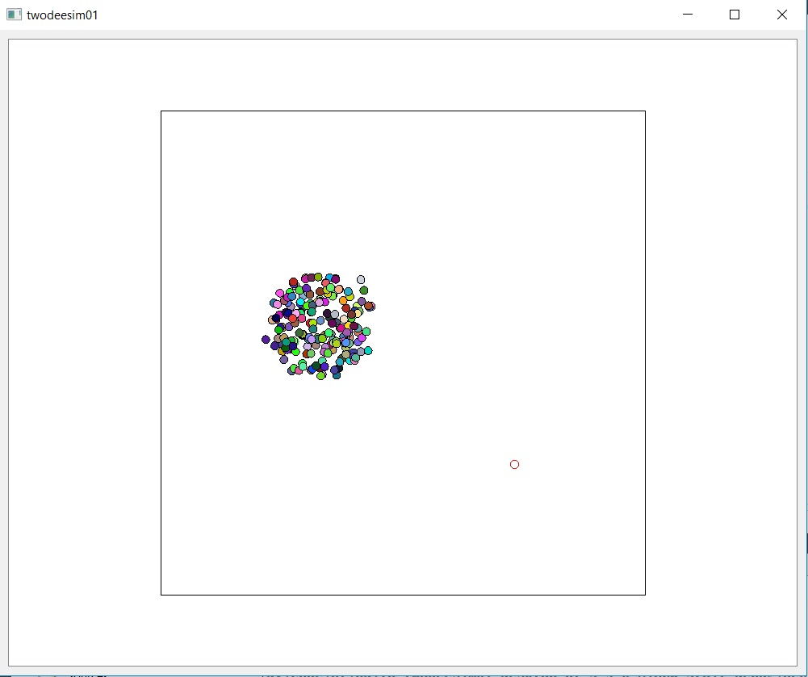

# huddlers-qt

A simple 2D graphical simulation in C++/Qt that animates circles "huddling" together, kind of like penguins or something.

_This code is copyright 2017 inhabited.systems and is free for anyone to use under the MIT license.  This code was written on Desktop Qt 5.9.0 MinGW 32-bit (Windows), and might not build successfully on later versions of Qt, or on other platforms such as Linux or MacOS, without modification._

THIS CODE IS UNSUPPORTED and no one is available to respond to questions or comments about it.
